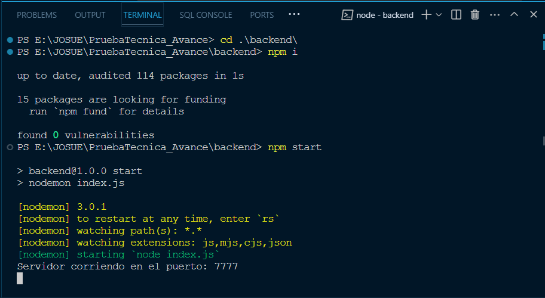

## Prueba técnica "AVANCE".

Cordial saludo.

En esta guía encontrarás los pasos que debes realizar para poder descargar, instalar y ejecutar este programa backEnd hecho con Node js y mongoDB.


##### ❗ Requisitos previos:

Para instalar las dependencias y poder ejecutar el programa, es necesario tener instalado el entorno de Node js en su equipo.

Si no lo tiene instalado, puede hacerlo siguiendo este enlace:

[Página oficial de Node js](https://nodejs.org/en/download)


#### ✅ Instalación y ejecución del proyecto.

Una vez instalado Node js, puedes clonar este repositorio directamente desde github, o hacerlo desde la terminal de comandos.

```
git clone https://github.com/josuegiraldos/PruebaTecnica_Avance
```


Luego de haber clonado el proyecto, desde la terminal, ingresar a la siguiente ruta:

```
cd backend
```


Una vez allí, debes realizar la instalación de las dependencias necesarias para ejecutar el programa:

```
npm i
```


Para iniciar el programa, desde la terminal, escribes el siguiente comando:

```
npm start
```


Debería aparecer de la siguiente manera:



En este momento, el programa ya debería estar ejecutándose correctamente.

El mensaje indicar que el programa está corriendo en el puerto 7777.


🔍 Los endpoints o consultas están enumerados del 1 al 7, de acuerdo a las consultas pedidas en el PDF de la prueba técnica.

Para poder visualizar las consultas, puedes usar plataformas como Postman o Thunder Client desde VSC, o incluso el mismo navegador web, a través del siguiente enlace:

```
`localhost:7777/endpoint1
```


El resultado debería ser el siguiente:


Solo debes ir cambiando la URL de la página, de 'localhost:7777/endpoint1' a 'localhost:7777/endpoint2' y así sucesivamente, hasta el 'localhost:7777/endpoint7'.


#### 🙌 Muchas gracias por la oportunidad de ser tenido en cuenta para esta grandiosa empresa.
